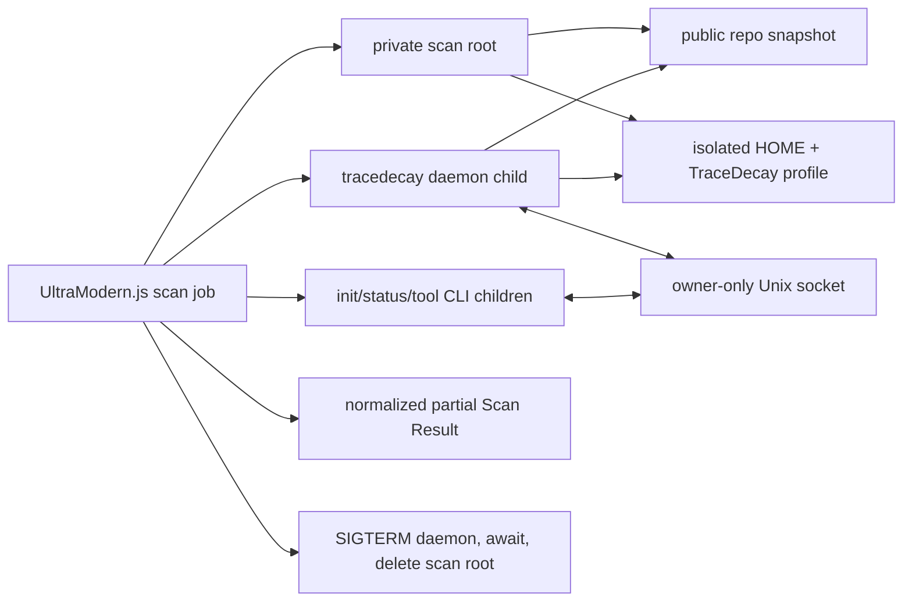

# TraceDecay v0.0.73 per-snapshot integration

- **Research date:** 2026-08-09
- **Subject:** Direct child-process integration of TraceDecay into the Codebase Radar Zerops MVP
- **Repository:** [ScriptedAlchemy/tracedecay](https://github.com/ScriptedAlchemy/tracedecay)
- **Pinned source:** [`v0.0.73` / `e2c7971c64aa8652ae7f35ec8d3f56be38c3acd5`](https://github.com/ScriptedAlchemy/tracedecay/tree/v0.0.73)
- **Confidence:** High for distribution, process, storage, CLI, and Linux-container behavior; medium for production resource ceilings because measurements cover two repositories, not a calibrated corpus

## Executive verdict

Use TraceDecay in the MVP, but use the process topology that v0.0.73 actually supports:

1. The UltraModern.js application creates a private temporary root for one scan.
2. It starts `tracedecay daemon run` as a **local child process** with a scan-local Unix socket and profile.
3. It spawns `tracedecay init`, `status`, and bounded `tool` commands against that socket.
4. It terminates and awaits the daemon, then deletes the entire scan root.

This remains one Zerops application service plus PostgreSQL. The daemon is not another deployment, API, queue, or network service. It is a child executable communicating over an owner-only Unix socket inside the application container.

The stronger “one shell command per query with no daemon process” hypothesis is **not supported by v0.0.73**. `tool`, `sync`, `status`, and stdio `serve` all broker through a running daemon. Only first-time `init` has a daemonless exclusive-maintenance path. This conclusion comes from the tagged source, the CLI help, and missing-daemon experiments—not from an architectural preference.

Pin the official `tracedecay-v0.0.73-x86_64-linux.tar.gz` release archive and verify SHA-256 `6a05fee84f503816f50bd1a48d6c7b755c0ded36ac5870561ca95ae7b05a675d`. It is MIT-licensed; retain the upstream `LICENSE` and `NOTICE` in product attributions.

For the eight-hour MVP, serialize TraceDecay phases (`max concurrent TraceDecay scans = 1`), use its bounded structural/health tools, and let the rest of a scan survive if TraceDecay fails. Do not put the TraceDecay redundancy result directly into the backlog: a local TSX probe produced obvious false positives, while a larger probe showed it can continue expensive work after the calling CLI times out. JSCPD is the safer first duplication source.

## Decision summary

| Question | Answer for the MVP | Confidence |
|---|---|---:|
| Exact version | `0.0.73`, tag commit `e2c7971…` | High |
| Distribution | Official x86_64 GNU/Linux release tarball, checksum pinned | High |
| License | MIT; preserve `LICENSE`; preserve `NOTICE` because it identifies adapted Apache-2.0 material | High |
| Application boundary | One application service; app-owned local child daemon plus short-lived CLI children | High |
| Separate scan service | No | High |
| Daemon optional? | Service installation is optional; a running daemon process is required for queries in v0.0.73 | High |
| Snapshot isolation | Unique temporary `HOME`, `TRACEDECAY_DATA_DIR`, `TRACEDECAY_GLOBAL_DB`, and Unix socket per scan | High |
| MVP concurrency | One TraceDecay scan at a time; later raise only with measurements | Medium-high |
| Baseline tools | `status`, `health`, `complexity`, both `coupling` directions, `circular`, `hotspots`, `test_risk` | High |
| Finding drill-down | `outline`/`find_exact_symbol`, then `impact`, `callers`, `callees`, `test_map` | High |
| Duplication | Use JSCPD; do not promote `redundancy` output in this release | Medium-high |
| Failure policy | TraceDecay is one fallible analyzer; record failure and continue other static analyzers | High |
| Container compatibility | Works in Debian Bookworm x86_64 with no extra runtime package installed | High |

## Version, artifact, and licensing

The GitHub API reported v0.0.73 as the latest stable release on 2026-08-09. The release was published 2026-08-04 and fixes retrieval of truncated daemon JSON. Stable release assets include x86_64 and aarch64 Linux archives, Windows, macOS, checksums, and GitHub artifact attestations. The official release workflow builds GNU/Linux artifacts on Ubuntu 22.04 and packages one executable; it does not publish a Cargo crate as the stable distribution path.

### Exact x86_64 artifact

| Property | Value |
|---|---|
| URL | `https://github.com/ScriptedAlchemy/tracedecay/releases/download/v0.0.73/tracedecay-v0.0.73-x86_64-linux.tar.gz` |
| SHA-256 | `6a05fee84f503816f50bd1a48d6c7b755c0ded36ac5870561ca95ae7b05a675d` |
| Download size observed | 40,480,281 bytes (~39 MiB) |
| Extracted executable observed | ~194 MiB |
| Format | x86_64 ELF PIE, dynamically linked |
| Needed libraries | `libgcc_s.so.1`, `libm.so.6`, `libc.so.6`, `ld-linux-x86-64.so.2` |
| Highest observed glibc symbol | `GLIBC_2.34` |

The archive checksum was verified locally against the release value, and the executable returned `tracedecay 0.0.73` inside `debian:bookworm-slim`. Do not use `/releases/latest` in a reproducible build.

Illustrative build step:

```dockerfile
ARG TRACEDECAY_VERSION=0.0.73
ARG TRACEDECAY_SHA256=6a05fee84f503816f50bd1a48d6c7b755c0ded36ac5870561ca95ae7b05a675d
RUN curl -fsSL \
      "https://github.com/ScriptedAlchemy/tracedecay/releases/download/v${TRACEDECAY_VERSION}/tracedecay-v${TRACEDECAY_VERSION}-x86_64-linux.tar.gz" \
      -o /tmp/tracedecay.tar.gz \
 && echo "${TRACEDECAY_SHA256}  /tmp/tracedecay.tar.gz" | sha256sum -c - \
 && tar -xzf /tmp/tracedecay.tar.gz -C /usr/local/bin tracedecay \
 && chmod 0755 /usr/local/bin/tracedecay \
 && rm /tmp/tracedecay.tar.gz
```

If Zerops resolves to ARM64, switch to `tracedecay-v0.0.73-aarch64-linux.tar.gz` and its release checksum instead of emulating x86_64. The release provides that target, but this research executed only x86_64.

The upstream [MIT license](https://github.com/ScriptedAlchemy/tracedecay/blob/v0.0.73/LICENSE#L1-L20) permits use and redistribution provided the copyright and permission notice remain. The upstream [NOTICE](https://github.com/ScriptedAlchemy/tracedecay/blob/v0.0.73/NOTICE#L1-L10) says its memory diff logic contains material adapted from Apache-2.0-licensed `mnemon`; ship both upstream files in an attribution page or distribution directory even though Radar will not call the memory features.

## Proven application-process topology



Why the daemon is required:

- The dynamic [`tool` command calls `call_default_tool`](https://github.com/ScriptedAlchemy/tracedecay/blob/v0.0.73/src/tool_command.rs#L119-L166), which connects to the daemon socket.
- [`sync` is implemented as `tracedecay_admin_sync` through the daemon](https://github.com/ScriptedAlchemy/tracedecay/blob/v0.0.73/src/commands/index.rs#L253-L288).
- [`serve` is now a database-free proxy](https://github.com/ScriptedAlchemy/tracedecay/blob/v0.0.73/src/serve.rs#L160-L174) and errors when the daemon socket is absent; stdio MCP does not bypass the daemon.
- [`init` alone can bootstrap under an exclusive maintenance lease](https://github.com/ScriptedAlchemy/tracedecay/blob/v0.0.73/src/commands/index.rs#L69-L131), but subsequent useful queries cannot.

The user guide’s “optional daemon service” wording means optional **systemd/launchd installation**, not optional daemon process for these current paths. This is a documentation ambiguity, not evidence for adding a Zerops service.

## Exact per-snapshot runner contract

### Directory layout

Create this with an unpredictable temporary directory owned by the application UID:

```text
<scan-root>/
  home/                 isolated HOME; prevents host-agent transcript discovery
  profile/              TraceDecay profile, registry, and project shards
  runtime/              mode 0700
    daemon.sock
  repo/                 shallow public-repository snapshot at one commit
```

TraceDecay mutates only the ephemeral snapshot/profile. `init` writes a repository identity marker under the clone’s Git common directory (`.git/tracedecay-project.json`) and stores the graph in the profile. This is acceptable only because Radar analyzes a disposable clone.

### Environment

Pass the same environment to the daemon and every TraceDecay CLI child:

| Variable | Value | Reason |
|---|---|---|
| `HOME` | `<scan-root>/home` | Prevent discovery/ingestion of unrelated host agent data |
| `TRACEDECAY_DATA_DIR` | `<scan-root>/profile` | Pin all TraceDecay data to disposable storage |
| `TRACEDECAY_GLOBAL_DB` | `<scan-root>/profile/global.db` | Keep registry/global DB within the scan root |
| `TRACEDECAY_DAEMON_SOCKET` | `<scan-root>/runtime/daemon.sock` | Route all CLI children to the app-owned daemon |
| `TRACEDECAY_DISABLE_GLOBAL_DB` | `1` | Disable global savings accounting; note that registry DB files still exist |
| `TRACEDECAY_SYNC_AUTO_WATCH` | `0` | Snapshot is immutable; watcher is unnecessary |
| `TRACEDECAY_SYNC_READ_REFRESH` | `0` | Avoid background refresh after the explicit init |
| `TRACEDECAY_SYNC_SESSION_START_SYNC` | `0` | Radar has no agent session to catch up |
| `TRACEDECAY_SYNC_BACKSTOP_INTERVAL_MINS` | `0` | Ephemeral scan does not need maintenance polling |
| `TRACEDECAY_SYNC_AUTO_INIT` | `0` | Require the explicit init phase |
| `TRACEDECAY_SYNC_AUTO_TRACK_PR_BRANCHES` | `0` | No GitHub API branch tracking in a snapshot scan |
| `NO_COLOR` | `1` | Cleaner diagnostics capture |

`TRACEDECAY_DATA_DIR` by itself is insufficient isolation. In one experiment it correctly isolated graph storage but the unchanged real `HOME` let the daemon ingest local agent transcripts; `user-sessions.db` grew toward 1 GiB. Repeating with both `HOME` and `TRACEDECAY_DATA_DIR` isolated held the entire profile to 2.1 MiB for a 13-file TSX snapshot. This is direct experimental evidence and the main operational pitfall in this report.

### Process sequence

Use direct argv-based child spawning, never concatenate a shell command from repository-controlled text.

1. Clone the allowlisted GitHub repository without submodules and resolve the exact commit.
2. Create `home`, `profile`, and mode-0700 `runtime` directories.
3. Spawn:

   ```text
   tracedecay daemon run --socket <scan-root>/runtime/daemon.sock
   ```

   Capture bounded stderr. Wait for the socket plus a short successful connection; fail startup after about 5 seconds.
4. Spawn with a 60-second MVP timeout:

   ```text
   tracedecay init <scan-root>/repo
   ```

5. Spawn status and selected read tools. Tool arguments should be passed as JSON on stdin:

   ```text
   tracedecay status <repo> --json
   tracedecay tool --project <repo> health --args - --json
   stdin: {"format":"json","details":true}
   ```

   The tagged CLI explicitly supports [`--args -` and raw `--json`](https://github.com/ScriptedAlchemy/tracedecay/blob/v0.0.73/src/tool_command.rs#L1-L31), avoiding shell injection and OS argv-size limits.
6. In `finally`, send `SIGTERM`, stop accepting new commands, wait up to 5 seconds, then `SIGKILL` if necessary. Await process exit before deleting the exact scan root. The source allows longer graceful drain/checkpoint windows, but timed-out scan data is disposable.
7. Delete the repo, socket, profile databases/WAL/SHM, response handles, and isolated home together by deleting the verified scan root. Do not run interactive `tracedecay wipe`; it needs offline exclusive ownership and confirmation, while the per-scan root is already the stronger cleanup boundary.

For the MVP, start and stop this daemon only around the TraceDecay phase. It is not a forever application sidecar and is not exposed on a TCP port.

## Machine-readable output contract

There are two distinct output shapes:

- `tracedecay status <repo> --json` prints a direct JSON object with counts, language distribution, branch/storage diagnostics, source bytes, index timing, and database health.
- `tracedecay tool ... --format json --json` prints the raw MCP result envelope. Its shape is `{"content":[{"type":"text","text":"..."}, ...]}`. The actual tool payload is a JSON string inside one `content[*].text` block. Warning and metrics blocks may appear before or after it.

Radar’s adapter should:

1. Parse stdout as the raw envelope.
2. Visit every text content block; do not assume `content[0]` is the payload.
3. Attempt JSON parsing on each text block and require exactly one machine payload.
4. If that payload has `truncated: true`, either mark the tool result incomplete or call `tracedecay tool ... retrieve` with the returned handle. Handles are local, project-scoped, and reported with a 24-hour TTL in the observed response.
5. Reject malformed or multiple payloads; retain a bounded diagnostic, not unbounded stdout/stderr.

This mirrors the upstream CLI’s own rule that handlers may prepend notices and append metrics. The v0.0.73 release specifically fixes retrieval of truncated daemon JSON, but bounded result limits remain preferable.

## MVP tool portfolio

### Run during every successful TraceDecay phase

| Command | JSON fields useful to Radar | Interpretation and limits |
|---|---|---|
| `status <repo> --json` | `file_count`, `node_count`, `edge_count`, language/kind maps, `total_source_bytes`, `last_sync_duration_ms`, DB health | Scan metadata and coverage, not a finding |
| `tool health` with `{"format":"json","details":true}` | `quality_signal`, six dimension scores, cycle edges, max depth, Gini, dead count | Repository summary. The “redundancy” dimension is actually `1 - dead_fns / total_fns`; do not present it as measured clone duplication |
| `tool complexity` with limit 20 | symbol ID, file/line, lines, branches, cyclomatic complexity, nesting, fan-in/out, composite formula score | Candidate structural hotspot; threshold and corroborate before making a finding |
| `tool coupling` `fan_in`, limit 20 | file plus `coupled_files` | File blast-radius proxy: how many files depend on it |
| `tool coupling` `fan_out`, limit 20 | file plus `coupled_files` | Change-complexity proxy: how many files it depends on |
| `tool circular` with max depth 10 | `cycle_count`, explicit cycles | Direct static graph evidence, subject to resolver completeness |
| `tool hotspots` with limit 20 | symbol ID, incoming/outgoing/total edge counts | Connectivity/context evidence; not automatically a defect |
| `tool test_risk` with limit 20 | symbol ID, complexity, fan-in, risk, attribution method/depth, static coverage summary | Static test-attribution lower bound, explicitly not executed coverage |

Keep these signals separate in the normalized model. TraceDecay’s own composite `complexity.score`, `test_risk.risk`, and `quality_signal` are different constructs and must not be collapsed into one invented severity.

### Use for selected-finding enrichment or remote MCP taskpacks

| Tool | Use |
|---|---|
| `outline --file ... --format json` | Find the smallest enclosing source symbol range for a line-based analyzer finding |
| `find_exact_symbol --name ... --format json` | Resolve the graph node ID, disambiguating by file and line |
| `impact --node-id ... --format json --max-depth 3` | Dependents/blast radius of the selected symbol |
| `callers` / `callees` | Concrete incoming/outgoing call context |
| `test_map` | Static tests attributed directly or through depth-3 call paths |
| `node` / `read` / `body` | Bounded evidence and agent context for the taskpack |

Do not bulk-run `impact` for every lint violation. Resolve it only for top-ranked or user-selected findings; many analyzer locations are not inside a uniquely resolvable symbol.

### Exclude or downgrade in this release

| Tool | Decision | Evidence |
|---|---|---|
| `redundancy` | Exclude as a source of MVP backlog findings | On a 13-file TSX snapshot, it reported `Legend`, `DetailPanel`, and `CodeGraphExplorer` as AST-isomorphic with identical 1,910-token bodies even though their bodies and sizes plainly differ. Treat this as a likely TSX/source-span defect until independently reproduced upstream. A larger call was also expensive and continued in the daemon after the CLI caller disappeared. |
| `dead_code` | Do not call project-wide in the normal scan | It has no limit/path parameter in v0.0.73. A 990-symbol result was response-handle truncated. Use the bounded dead count in `health`; only retrieve lists on demand. Dead-code output is candidate evidence, not proof because entry points/framework wiring can be dynamic. |
| `dsm` | Do not depend on it as JSON | `--json` wraps an MCP result, but the v0.0.73 DSM tool itself emitted Markdown and exposes no `format` parameter. `coupling` and `health` provide the needed machine inputs. |
| `unused_imports` | Defer | Oxlint/TypeScript analyzers have more language-specific authority and less overlap ambiguity. |
| Any edit, diagnostics, build, test, LSP, or external-tool tool | Exclude | Violates the read-only static boundary or can execute repository/toolchain behavior. |

## Project identity, storage, and cleanup

Normal storage is profile-sharded. `TRACEDECAY_DATA_DIR=<profile>` yields approximately:

```text
<profile>/
  daemon-authority.json
  daemon-authority.lock
  lifecycle.lock
  global.db{,-wal,-shm}
  user-sessions.db{,-wal,-shm}
  projects/<project-id>/
    tracedecay.db{,-wal,-shm}
    config.json
    store_manifest.json
    branch-meta.json
    sessions.db{,-wal,-shm}
    response-handles/
    lcm-payloads/
    sync.lock
```

The [tagged storage code](https://github.com/ScriptedAlchemy/tracedecay/blob/v0.0.73/crates/tracedecay-runtime-core/src/storage.rs#L344-L408) places project stores at `profile/projects/<project-id>`. Before a persistent identity exists, the default ID is `proj_` plus the first 16 hex digits of SHA-256 over the canonical local project path. For Git repositories, `init` persists a stable repository identity under the Git common directory. The [store layout](https://github.com/ScriptedAlchemy/tracedecay/blob/v0.0.73/crates/tracedecay-runtime-core/src/storage.rs#L1177-L1214) owns the graph DB, sessions DB, response handles, dirty marker, and locks.

Implications:

- Reusing one clone path/profile across commits would produce incremental history, but Radar’s required canonical unit is a repository snapshot. Prefer fresh root/profile and compare Scan Results in PostgreSQL.
- Two scan roots cannot collide if each has a unique profile and socket.
- Never point TraceDecay at the application user’s real home/profile.
- Stop the daemon before deletion. It is the sole database owner and holds profile/project locks and cached DB handles.
- Delete only the verified child of Radar’s configured temp parent, after checking its scan ID marker and ensuring the daemon PID belongs to that scan job.

## Concurrency and isolation

The official README says most read tools are safe to call in parallel, and the daemon accepts concurrent socket clients. Internally it has per-project single-flight opens, a daemon-wide writer-administration gate, a per-project sync lock, SQLite WAL, and a default cap of two concurrent background syncs.

For this MVP, none of that justifies concurrent TraceDecay scans:

- One large local index used ~407 MB daemon RSS; concurrent scans can exhaust a modest combined Node/analyzer container.
- A timed-out expensive tool can keep consuming daemon CPU until the daemon is terminated.
- Serial bounded calls simplify output attribution and shutdown.
- Other analyzers can still run before/after TraceDecay; the application needs no HTTP worker boundary.

Recommendation: database job state can admit multiple queued scans, but an in-process semaphore permits one TraceDecay phase. A future measured version can run `N` scan-local daemons because profile/socket isolation is complete; do not make that deadline work.

## Failure and partial-result behavior

| Failure | Observed/upstream behavior | Radar behavior |
|---|---|---|
| Daemon absent | CLI exits 1: daemon socket unavailable | Mark TraceDecay unavailable; continue other analyzers |
| Project not initialized | Tool CLI exits 1 with explicit `run tracedecay init first` | Treat as init phase failure, not empty healthy output |
| Invalid tool args | CLI validation fails nonzero before dispatch | Adapter/config defect; retain diagnostic and fail TraceDecay phase |
| CLI exits nonzero | Errors are stderr text, not a normal JSON payload | Never parse stdout as success; capture exit code/signal and bounded stderr |
| Large result | MCP returns a JSON handle envelope with preview and TTL | Prefer tool limits; optionally retrieve exact payload; otherwise mark incomplete |
| Socket closes after request send | Source reports outcome unknown and deliberately does not retry | Selected tools are read-only, but MVP should record failure rather than build a retry system |
| Command timeout | Killing the CLI does not prove daemon computation stopped | Terminate the scan-local daemon, await/kill, then delete profile |
| Tool-specific failure | Other tool results may still be valid | Preserve per-tool status; do not discard the whole scan |
| Daemon crash/interrupted write | Dirty/WAL/lock recovery may run on reopen | Snapshot data is disposable; do not attempt repair in MVP—fail partial and clean root |
| Cleanup fails | Temp data may remain | Record cleanup failure internally and sweep only verified stale scan roots on service startup |

The canonical Scan Result should include analyzer execution metadata (`version`, `status`, `duration`, `timed_out`, bounded diagnostic) and must distinguish “no finding” from “analyzer did not return evidence.”

## Resource and timing evidence

These are direct experiments on v0.0.73, not vendor guarantees.

| Probe | Source | Result |
|---|---:|---:|
| Clean TSX snapshot, macOS ARM64 | 13 files / 74,380 source bytes | CLI init wall 0.91 s; graph DB 729,088 B; isolated profile 2.1 MiB; daemon RSS ~32 MB |
| Same snapshot, Debian Bookworm x86_64 container under emulation | 13 files / 74,380 source bytes | End-to-end init 1.195 s; profile 1.3 MiB after shutdown; daemon RSS 42.2 MB, VmHWM ~47 MB |
| TraceDecay’s own mixed-language repo, macOS ARM64 | 1,147 files / 19.2 MB supported source / 42,733 nodes / 80,919 edges | Indexed in 12.0 s (13.9 s CLI wall); graph DB 162.9 MB; daemon RSS ~406.6 MB after open |
| Release artifact | — | ~39 MiB compressed; ~194 MiB executable |

The large graph DB was about 8.5 times supported source bytes in that one repository. This is not a reliable universal multiplier: symbol/edge density and language mix dominate. The contaminated-profile experiment is excluded from normal sizing because it intentionally exposed the `HOME` isolation pitfall.

Deadline-safe initial limits:

- one TraceDecay phase at a time;
- 60 seconds for init, 10 seconds per bounded query, 90 seconds total TraceDecay phase;
- reject or skip TraceDecay above roughly 1,500 supported source files or 20 MiB supported source in the first demo, unless corpus research proves a better cap;
- reserve at least 1 GiB RAM for the whole combined service, with 2 GiB safer when Node and the other analyzers coexist;
- reserve at least 2 GiB ephemeral disk and enforce per-scan cleanup.

Those caps are recommendations/inferences from limited measurements. Report them as implementation safety defaults, not TraceDecay specifications.

## Zerops/Linux deployment result

The official x86_64 artifact was mounted read-only into a clean `debian:bookworm-slim` container. With only isolated directories and environment variables, it:

1. reported version 0.0.73;
2. launched the foreground daemon on a Unix socket;
3. initialized the 13-file TypeScript snapshot;
4. returned direct status JSON;
5. returned the `health` MCP envelope containing structured JSON;
6. exited cleanly on `SIGTERM`.

No Rust compiler, Node dependency install, Git executable, systemd, or extra shared-library package was installed in that runtime container. Debian Bookworm satisfies the artifact’s observed glibc 2.34 requirement. This proves a conventional glibc-based Zerops Linux application image can carry the binary. It does not prove an Alpine/musl image; do not use Alpine for this pinned GNU artifact.

## Applicability limits and disagreements

### Direct evidence

- Artifact contents/checksum, tagged CLI behavior, storage layout, process routing, container execution, and the two local resource probes.
- Structured fields returned by the selected tools.

### Inference

- A 1–2 GiB RAM allocation and the proposed source/file caps should be safe enough for one deadline demo. These need corpus validation.
- One daemon per TraceDecay phase is the simplest safe cleanup topology. A long-lived app-owned daemon could be more efficient later, but project-cache eviction and live-store deletion would need deliberate lifecycle support.

### Weak or misleading claims to avoid

- “No daemon”: false for current query paths.
- “Separate service required”: also false; local child process is sufficient.
- “Coverage”: `test_risk` and `test_map` provide static attribution lower bounds, not executed test coverage.
- “Dead code”: no incoming indexed edge is a candidate, not proof under framework entry points/reflection.
- “Business/security impact”: TraceDecay supplies structure and blast radius, not verified runtime, financial, or vulnerability impact.
- “Quality score means priority”: `quality_signal` summarizes graph properties; Radar must combine it with analyzer evidence and explainable prioritization.
- “All JSON flags mean a JSON domain payload”: DSM demonstrates that raw MCP JSON can still contain Markdown tool text.

### Upstream documentation disagreement

The [README’s tool and storage overview](https://github.com/ScriptedAlchemy/tracedecay/blob/v0.0.73/README.md#L18-L28) and [User Guide](https://github.com/ScriptedAlchemy/tracedecay/blob/v0.0.73/docs/USER-GUIDE.md) remain useful, but parts of the design document and “optional daemon” language describe older or ambiguous behavior. Tagged executable help and tagged runtime source take precedence for the adapter contract.

## Eight-hour implementation recommendations

1. **Vendor and verify v0.0.73 in the image.** Never download “latest” at runtime.
2. **Implement one small TraceDecay adapter**, not a generic analyzer platform: `startDaemon`, `init`, `callTool`, `parseMcpPayload`, `stopDaemon`, `cleanup`.
3. **Serialize the TraceDecay phase.** This is an in-process semaphore, not a worker service.
4. **Isolate `HOME` and all TraceDecay paths.** Treat this as mandatory, not hardening backlog.
5. **Use only the bounded baseline portfolio.** Map outputs to observations/evidence; promote a finding only under Radar’s normalizer/prioritizer rules.
6. **Use TraceDecay for blast-radius enrichment after candidate selection.** Resolve a symbol, then call `impact`/`test_map`; do not traverse every lint result.
7. **Skip TraceDecay redundancy and project-wide dead-code listings.** JSCPD owns duplication in the MVP; `health.dead_count` can be displayed as a cautious observation.
8. **Preserve partial scans.** A TraceDecay timeout must not erase Oxlint, TSConfig, OSV, Zizmor, or JSCPD evidence.
9. **Always terminate the scan-local daemon before cleanup.** Killing only a timed-out CLI is insufficient.
10. **Expose exact provenance:** analyzer `tracedecay`, version `0.0.73`, tool name/args, repository commit, direct/proxy/inference evidence class.

## Sources

All substantive project claims use primary upstream sources:

1. [TraceDecay v0.0.73 release](https://github.com/ScriptedAlchemy/tracedecay/releases/tag/v0.0.73) — release date, fix note, official artifacts, checksums/attestations.
2. [README at v0.0.73](https://github.com/ScriptedAlchemy/tracedecay/blob/v0.0.73/README.md) — supported purpose, high-level tool families, storage/privacy, installation, read-tool parallelism.
3. [User Guide at v0.0.73](https://github.com/ScriptedAlchemy/tracedecay/blob/v0.0.73/docs/USER-GUIDE.md) — init/sync semantics, default skips, machine output, static test interpretation, daemon/service guidance.
4. [Dynamic CLI tool implementation](https://github.com/ScriptedAlchemy/tracedecay/blob/v0.0.73/src/tool_command.rs) — JSON/stdin contract, daemon dispatch, multi-block output handling.
5. [Init/sync command implementation](https://github.com/ScriptedAlchemy/tracedecay/blob/v0.0.73/src/commands/index.rs) — daemonless-init exception and daemon-brokered sync.
6. [Serve implementation](https://github.com/ScriptedAlchemy/tracedecay/blob/v0.0.73/src/serve.rs#L160-L174) and [daemon client implementation](https://github.com/ScriptedAlchemy/tracedecay/blob/v0.0.73/src/daemon.rs#L1510-L1585) — required socket process and failure semantics.
7. [Runtime configuration](https://github.com/ScriptedAlchemy/tracedecay/blob/v0.0.73/crates/tracedecay-runtime-core/src/config.rs) and [storage layout](https://github.com/ScriptedAlchemy/tracedecay/blob/v0.0.73/crates/tracedecay-runtime-core/src/storage.rs) — isolation environment, profile shards, IDs, locks, database/handle paths.
8. [Release workflow](https://github.com/ScriptedAlchemy/tracedecay/blob/v0.0.73/.github/workflows/release.yml#L27-L145) and [installer](https://github.com/ScriptedAlchemy/tracedecay/blob/v0.0.73/install.sh) — Linux targets, packaging, checksum verification.
9. [LICENSE](https://github.com/ScriptedAlchemy/tracedecay/blob/v0.0.73/LICENSE) and [NOTICE](https://github.com/ScriptedAlchemy/tracedecay/blob/v0.0.73/NOTICE) — redistribution obligations and third-party attribution.

## Confidence and methodology

High-confidence claims were verified against the exact release tag and, where behavioral, against the v0.0.73 executable. The research used GitHub API metadata, tagged source/document review, CLI schema inspection, isolated macOS experiments, artifact checksum/ELF inspection, and an end-to-end Debian Bookworm x86_64 container probe. Resource ceilings and the TSX redundancy concern are explicitly labeled from limited experiments rather than generalized as upstream guarantees.
